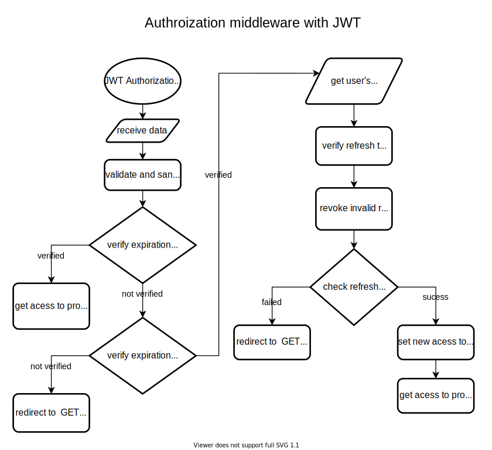

# express-jwt-auth

Template project for express js for authentication, authorization and session management with JWT.

## User model

```typescript
{
  username: {type: String, unique: true},
  email: {type: String, unique: true},
  password: String,
  JWTSession: {refreshTokens: []}
}
```

## Routes

| Method | Path         | Desc                 |
|--------|--------------|----------------------|
| POST   | /user/signup | create user          |
| POST   | /user/signin | login user           |
| GET    | /protected   | protected mock route |

## Steps to reproduce

### 1. create a `.env` file with the following environment variables
* DB_URI: connection string for connecting to the mongoDB server
* ACCESS_TOKEN_SECRET: secret to sign acess token
* REFRESH_TOKEN_SECRET: secret to sign refresh token
* PORT: usually 8000, or 3000
### 2. Run `npm i` to install all dependencies
### 3. Run `npm run start`, which is a shortcut for `npx nodemon --watch ./src ./src/index.ts` which uses nodemon to watch the `./src` directory and runs the `./src/index.ts` file with the REPL tool `ts-node`.

## How the flow works

### Authentication data flow diagram


### Authorization data flow diagram


### Authorization middleware flowchart

